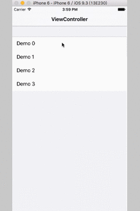

# LLSegmentedControl

现在很多app在添加选择控件的时候不没有选择iOS系统提供的UISegmentedControl，而是选择自定义控件，其中最常见的就是类似下面这种：


这是驴妈妈妈的游轮选择舱房页，相信大家一般也都遇到过这个UI需求，今天把这个UI控件分享给大家，使用时只需要 #import "LLSegmentedControl.h" 就可以使用了，使用实例如下：

```
LLSegmentedControl *segmentedControl = [[LLSegmentedControl alloc] initWithFrame:CGRectMake(0, 100, kScreenWidth, 64) titleArray:@[@"内舱房", @"海景房", @"阳台房", @"歌诗达邮轮", @"公主邮轮", @"内舱房", @"海景房", @"阳台房", @"歌诗达邮轮", @"公主邮轮"]];
segmentedControl.backgroundColor = [UIColor colorWithWhite:0.f alpha:0.1];
segmentedControl.segmentedControlLineStyle = LLSegmentedControlStyleUnderline;
segmentedControl.segmentedControlTitleSpacingStyle = LLSegmentedControlTitleSpacingStyleWidthAutoFit;
// lineWidthEqualToTextWidth 设置为YES, lineWidth 属性则不需设置
segmentedControl.lineWidthEqualToTextWidth = YES;
segmentedControl.textColor = [UIColor darkTextColor];
segmentedControl.selectedTextColor = [UIColor brownColor];
segmentedControl.font = [UIFont systemFontOfSize:16];
segmentedControl.selectedFont = [UIFont boldSystemFontOfSize:20];
segmentedControl.lineColor = [UIColor magentaColor];
segmentedControl.lineHeight = 4.f;
// segmentedControlTitleSpacingStyle 设置为 LLSegmentedControlTitleSpacingStyleSpacingFixed
// 则不需要设置 titleWidth 属性
segmentedControl.titleSpacing = 30;
segmentedControl.defaultSelectedIndex = 2;
[self.view addSubview:segmentedControl];

// 点击回调
[segmentedControl segmentedControlSelectedWithBlock:^(LLSegmentedControl *segmentedControl, NSInteger selectedIndex) {
NSLog(@"selectedIndex : %zd", selectedIndex);
}];
```

使用起来非常简单，.h文件提供属性及方法提供给大家，这样就非常清楚了：
```
#import <UIKit/UIKit.h>

@class LLSegmentedControl;

typedef void (^LLSegmentedControlBlock) (LLSegmentedControl *segmentedControl, NSInteger selectedIndex);

// 下划线样式
typedef NS_ENUM(NSUInteger, LLSegmentedControlLineStyle) {
    LLSegmentedControlStyleUnderline = 0, //  下划线在底部
    LLSegmentedControlStyleTopline = 1, // 下划线在顶部
    LLSegmentedControlLineStyleHidden = 2, // 下划线隐藏
};

// 文字排列样式
typedef NS_ENUM(NSUInteger, LLSegmentedControlTitleSpacingStyle) {
    // 文字自适应, 不需要设置titleWidth, 需要设置间距 titleSpacing
    LLSegmentedControlTitleSpacingStyleWidthAutoFit = 0,
    // 文字宽度固定, 只需要设置titleWidth, 不需要设置titleSpacing
    LLSegmentedControlTitleSpacingStyleWidthFixed = 1,
};

@interface LLSegmentedControl : UIView

#pragma mark -
#pragma mark - init methods
- (instancetype)init;

- (instancetype)initWithFrame:(CGRect)frame;

- (instancetype)initWithFrame:(CGRect)frame titleArray:(NSArray <NSString *>*)titleArray;

#pragma mark -
#pragma mark - @properties
/**
 * @property titleArray: 显示文字数组
 */
@property (nonatomic, strong) NSArray <NSString *>*titleArray;

/**
 * @property segmentedControlLineStyle: 下划线样式
 */
@property (nonatomic, assign) LLSegmentedControlLineStyle segmentedControlLineStyle;

/**
 * @property segmentedControlTitleSpacingStyle: 显示文字的间距样式
 */
@property (nonatomic, assign) LLSegmentedControlTitleSpacingStyle segmentedControlTitleSpacingStyle;
/**
 * @property lineWidthEqualToTextWidth: 下划线样式是否与当前位置的文字宽度相等
 * 如果为YES则表示下划线的宽度和文字的宽度相等, 不需要设置lineWidth 属性
 */
@property (nonatomic, assign) BOOL lineWidthEqualToTextWidth;

/**
 * @property textColor: 字体颜色
 */
@property (nonatomic, strong) UIColor *textColor;

/**
 * @property selectedTextColor: 选中位置字体颜色
 */
@property (nonatomic, strong) UIColor *selectedTextColor;

/**
 * @property font: 字体
 */
@property (nonatomic, strong) UIFont *font;

/**
 * @property selectedFont: 选中位置字体
 */
@property (nonatomic, strong) UIFont *selectedFont;

/**
 * @property lineColor: 下划线颜色
 */
@property (nonatomic, strong) UIColor *lineColor;

/**
 * @property lineHeight: 下划线高度
 */
@property (nonatomic, assign) CGFloat lineHeight;

/**
 * @property lineWidth: 下划线宽度
 */
@property (nonatomic, assign) CGFloat lineWidth;

/**
 * @property titleWidth: 文字宽度
 */
@property (nonatomic, assign) CGFloat titleWidth;

/**
 * @property titleSpacing: 文字间隔
 */
@property (nonatomic, assign) CGFloat titleSpacing;

/**
 * @property defaultSelectedIndex: 默认选中位置
 */
@property (nonatomic, assign) NSInteger defaultSelectedIndex;

/**
 * @property selectedIndex: 当前选中位置
 */
@property (nonatomic, assign, readonly) NSInteger selectedIndex;

/**
 * 点击回调
 */
- (void)segmentedControlSelectedWithBlock:(LLSegmentedControlBlock)block;
```

Demo样式如下：



如果你对这个Demo感兴趣，请给个star奥 !!! 谢谢大家 😊!!!